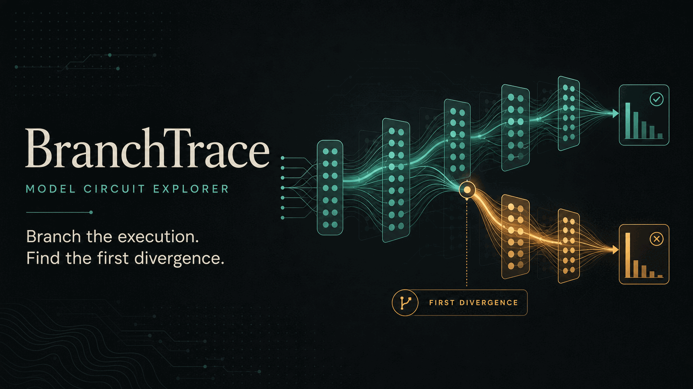
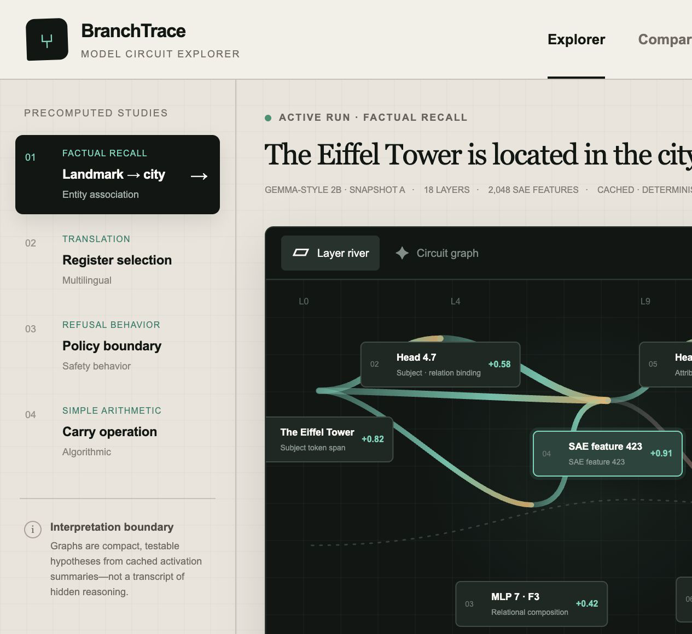
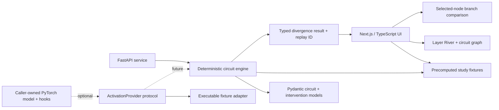

# BranchTrace Model Circuit Explorer

> Git branching, but for internal neural-network computations.

[](https://nextjs.org/)
[](https://www.typescriptlang.org/)
[](https://fastapi.tiangolo.com/)
[](https://www.python.org/)
[](#verification)
[](#verification)

BranchTrace is a portfolio-quality mechanistic-interpretability workbench. It turns a cached activation summary into a compact circuit hypothesis, lets the user branch an execution at an influential component, and makes the resulting counterfactual easy to inspect:

- select an attention head, sparse feature, or residual-path component;
- **suppress**, **amplify**, or **patch** its activation;
- compare the original and branched answers;
- locate the **first meaningful divergence**;
- inspect how the apparent circuit changes across model versions.

No credentials, model weights, or GPU are required. The included examples are deterministic public-model-style fixtures, so the entire interaction is reproducible on a laptop.

## Showcase



**The idea in one frame.** Teal is the cached baseline path; amber is the counterfactual branch after an intervention. The marked junction is the first layer where the deterministic fixture reports a meaningful downstream change.

<table>
  <tr>
    <td width="54%">
      
    </td>
    <td width="46%">
      
    </td>
  </tr>
  <tr>
    <td><strong>Literal application capture.</strong> Pick a study on the left, inspect estimated contribution paths in the center, and configure the selected component in the intervention lab.</td>
    <td><strong>Four-second workflow overview.</strong> Select a component, create a branch, and compare the unchanged baseline with the counterfactual output. This is explanatory presentation media—not model evidence.</td>
  </tr>
</table>

The included showcase is deliberately legible without interpretability background: path width means larger fixture-estimated contribution, teal/red mean positive/negative contribution, and amber appears only after a branch reports downstream divergence. All media lives in the repository, so it renders on GitHub without an external host.

## Why this exists

Attribution graphs and activation patching are most useful when they lead to falsifiable interventions. A visually important node is not automatically causal; BranchTrace therefore centers the workflow on a before/after execution rather than treating a graph as an explanation by itself.

The MVP deliberately separates three claims:

1. **Attribution hypothesis** — the displayed paths summarize estimated influence in one cached run.
2. **Causal test** — an intervention changes one component and observes downstream behavior.
3. **Interpretation** — a human-readable label is a tentative description, not a uniquely correct semantic meaning.

BranchTrace does **not** claim to reveal private chain-of-thought, a definitive reasoning transcript, or the one true circuit used by a model.

## Product walkthrough

1. Choose one of four built-in studies: factual recall, translation register, refusal behavior, or arithmetic carry. Use the header control to switch between the light and dark themes; the preference persists on the device.
2. The **Layer River** displays tokens, attention paths, MLP and SAE features, residual flow, and the output logit. Path width encodes estimated contribution; color distinguishes positive and negative influence.
3. Switch to **Circuit Graph** for a node-link view whose edge labels identify attention, MLP, residual, and logit paths.
4. Click a component. The intervention lab shows its layer, activation magnitude, attribution score, and fixture expectations.
5. Choose:
   - **Suppress** — scale the selected activation to zero.
   - **Amplify** — scale it to `1.80×`.
   - **Patch** — replace it with a contrast-run activation.
6. Run the branch. The counterfactual panel shows the answer, confidence, fixture-selected downstream nodes, and first meaningful divergence. Low-score controls correctly produce no meaningful divergence.
7. Enable **Model Version Diff** to compare where an analogous behavior appears in a second precomputed snapshot. The diff changes with the selected study.

The default factual-recall fixture is intentionally easy to read:

```text
Original:  Eiffel Tower → Feature 423 → answer “Paris”  (94.2%)
Branch:    Eiffel Tower → Feature 423 suppressed
First divergence: Layer 17
Changed answer: “Lyon”  (61.8%)
```

The numbers above are deterministic demonstration data. `L0–L18` is a normalized fixture-depth axis, not a claim that every displayed item is a transformer block. The displayed answer is a model completion and may span multiple tokens. These values validate the product and API workflow; they are not measurements from Gemma or any other downloaded checkpoint.

## Architecture



### Frontend

| Surface | Responsibility |
| --- | --- |
| `app/branchtrace-app.tsx` | Accessible study/view/component selection, branch comparison, changed-node highlighting, and model-version diff |
| `app/circuit-data.ts` | Typed studies, graph topology, version diffs, and the deterministic offline intervention mirror |
| `app/globals.css` | Responsive research-console visual system and graph styling |
| `app/layout.tsx` | Product metadata and social preview |

Both visualizations are purpose-built and dependency-light: contribution paths are rendered in SVG, while nodes remain semantic HTML buttons with visible keyboard focus and `aria-pressed` state. The Layer River emphasizes depth and flow; the Circuit Graph emphasizes topology and typed edges. The UI provides tested light and dark themes, initializes from the saved preference or system preference without a theme flash, honors reduced-motion preferences, and reflows for tablet/mobile layouts.

### Python service

| Module | Responsibility |
| --- | --- |
| `service/branchtrace/models.py` | Typed nodes, edges, runs, intervention requests, and divergence results |
| `service/branchtrace/fixtures.py` | Reproducible study fixtures |
| `service/branchtrace/engine.py` | Pure circuit synthesis, intervention semantics, and replay hashing |
| `service/branchtrace/adapters.py` | Runtime-checkable provider protocol, shape-checked executable fixture adapter, and explicit PyTorch hook seam |
| `service/branchtrace/main.py` | FastAPI transport, OpenAPI docs, CORS, and domain-error mapping |

The engine is pure and deterministic. Identical intervention inputs produce an identical 16-character replay ID. Model-specific code stays behind `ActivationProvider`; its included fixture implementation validates prompt, target, layer, and activation shape before patching. `TorchHookBoundary` intentionally raises `NotImplementedError` because no model-specific hook points, tokenizer, or continuation strategy can be honest without choosing a real model architecture.

## Quick start

### Requirements

- Node.js `22.13+`
- Python `3.11+`

### 1. Install the web app

```bash
npm ci
npm run dev
```

Open the local URL printed by the development server (normally [http://localhost:3000](http://localhost:3000)).

### 2. Start the API

In a second terminal:

```bash
python3 -m venv .venv
source .venv/bin/activate
pip install -e "service[dev]"
uvicorn branchtrace.main:app --app-dir service --reload
```

The service is available at:

- API: [http://127.0.0.1:8000](http://127.0.0.1:8000)
- Swagger UI: [http://127.0.0.1:8000/docs](http://127.0.0.1:8000/docs)
- OpenAPI schema: [http://127.0.0.1:8000/openapi.json](http://127.0.0.1:8000/openapi.json)

The browser demo remains fully interactive when the API is not running because its fixtures are bundled. The service exists as the production-grade typed boundary for circuit generation and intervention execution.

## API

### `GET /health`

Returns the engine and fixture version.

### `GET /v1/demos`

Lists the built-in studies.

### `GET /v1/circuits/{demo_id}`

Returns the baseline model run plus typed circuit nodes and edges.

### `POST /v1/interventions`

```bash
curl -X POST http://127.0.0.1:8000/v1/interventions \
  -H "Content-Type: application/json" \
  -d '{
    "demo_id": "factual-recall",
    "feature_id": "feature-423",
    "mode": "suppress"
  }'
```

The result contains:

- original and branched `ModelRun` values;
- `first_layer`, `changed_node_ids`, and `answer_changed`;
- selected contribution before and after the intervention;
- a stable `deterministic_replay_id`;
- an explicit fixture caveat.

Supported modes are `suppress`, `amplify`, and `patch`. Optional `strength` is an activation scale constrained to `[0, 4]`; `patch_source` is accepted only for patch requests, must be non-empty, and becomes part of the deterministic replay identity. Unknown demos/features return `404`; malformed modes, out-of-range strength, and invalid mode-specific fields return `422`.

## Verification

Run all web checks:

```bash
npm run verify
```

`npm run verify` builds the production worker, type-checks and lints the web app, runs the browser-side and rendered-HTML suites, checks/formats the Python service with Ruff, runs the engine/API tests, and audits npm dependencies. The individual Python test command is:

```bash
.venv/bin/pytest service/tests
```

Verified locally:

| Check | Result |
| --- | --- |
| Vinext/Next.js production build | Passed |
| Browser-side circuit/intervention semantics | 5 passed |
| DOM interaction workflows (theme persistence, views, demos, all modes, diffs) | 6 passed |
| Server-rendered product and metadata tests | 2 passed |
| ESLint | Passed |
| TypeScript compiler (`--noEmit`) | Passed |
| Python formatting and linting (Ruff) | Passed |
| Deterministic engine, adapter, and FastAPI contracts | 24 passed |
| End-to-end API flow (`demos → circuit → suppress`) | Passed |
| Live HTTP smoke (`/`, `/health`, `/v1/interventions`) | Passed |
| npm production/development dependency audit | 0 vulnerabilities |

The 37 checks cover theme persistence, typed graph synthesis, high-influence suppression, low-score controls, amplification, patch provenance, replay stability, intervention-at-logit ordering, study-specific labels, safe refusal counterfactuals, adapter target/shape validation, invalid IDs and request fields, API health, and a complete answer-changing workflow. Source-presence assertions are supplementary; branch semantics are executed directly in TypeScript and Python.

## From fixture to real model

A production adapter would:

1. accept a caller-owned open-weight `torch.nn.Module`;
2. register narrowly scoped forward hooks for residual, attention, and MLP locations;
3. persist only the activation summaries needed for the selected method;
4. learn or load an SAE/transcoder dictionary where appropriate;
5. calculate an attribution score using a declared metric;
6. replay a true activation ablation or patch;
7. return results through the existing `CircuitGraph` and `InterventionResult` models.

Model loading is intentionally out of scope for this credential-free MVP. The browser’s “snapshots” and model-version deltas are deterministic fixtures, not loaded checkpoints or empirical evaluation results. This avoids hidden downloads, license ambiguity, large disk usage, and misleading claims that fixture outputs came from Gemma or any other named checkpoint. Wiring a real model also requires declaring tokenizer alignment, hook locations, patch metric, corruption baseline, batching policy, device/dtype behavior, and activation retention limits.

## Interpretability caveats

- **Graphs are lossy.** A sparse graph omits interactions and may not be complete.
- **Feature labels are hypotheses.** SAE features can split, merge, or remain polysemantic.
- **Attribution is not intervention.** A high attribution score should predict a causal effect, but this must be measured.
- **Patching depends on the metric and corruption setup.** Results can be misleading when the baseline, patch source, or target metric is poorly chosen.
- **One prompt is not a behavior.** Stability should be measured across paraphrases, contexts, seeds, and model checkpoints.
- **Replacement models add approximation error.** A transcoder or SAE-derived graph does not exactly reproduce the original network.

The next research-grade evaluation would report faithfulness, completeness, sparsity, paraphrase stability, causal precision, and human comprehension—not graph aesthetics alone.

## Research grounding

BranchTrace’s design is informed by primary sources:

- Anthropic’s [Circuit Tracing: Revealing Computational Graphs in Language Models](https://transformer-circuits.pub/2025/attribution-graphs/methods.html) introduces attribution graphs built with cross-layer transcoders and emphasizes validation tooling.
- Anthropic’s [Tracing Attention Computation Through Feature Interactions](https://transformer-circuits.pub/2025/attention-qk/index.html) extends attribution graphs to attention feature interactions.
- Bricken et al., [Towards Monosemanticity](https://transformer-circuits.pub/2023/monosemantic-features/index.html), demonstrates sparse-autoencoder feature decomposition and basic circuit analysis.
- Templeton et al., [Scaling Monosemanticity](https://transformer-circuits.pub/2024/scaling-monosemanticity/index.html), studies SAE features at production-model scale while documenting important limitations.
- Heimersheim and Nanda, [How to use and interpret activation patching](https://arxiv.org/abs/2404.15255), explains what evidence patching provides and why metric choice and corruption design can change the conclusion.
- Zhang and Nanda, [Towards Best Practices of Activation Patching in Language Models](https://arxiv.org/abs/2309.16042), systematically finds that metric and corruption-method choices can produce disparate localization results.
- Kramár et al., [AtP*: An efficient and scalable method for localizing LLM behaviour to components](https://arxiv.org/abs/2403.00745), evaluates scalable attribution-patching approximations and documents false-negative failure modes.

These references motivate the intervention-first workflow; they do not validate the included fixture values.

## Project status

This repository is a complete local MVP:

- polished responsive web interface;
- four immediately explorable studies;
- three intervention modes;
- original-versus-branched execution comparison;
- visible first divergence and changed answer;
- model-version circuit diff;
- typed deterministic API;
- executable, validated model-adapter contract plus an explicit unimplemented PyTorch seam;
- automated frontend, engine, API, and smoke verification;
- no credentials or model download required.

## License

No license has been selected for this portfolio project. Add one before redistributing or accepting external contributions.
