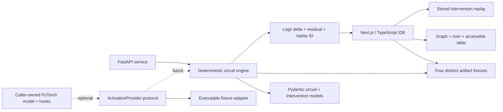

# BranchTrace Model Circuit Explorer

> A debugger-style workbench for circuit hypotheses and stored interventions.

[](https://marinjursic.github.io/branchtrace-circuit-explorer/)
[](https://github.com/MarinJursic/branchtrace-circuit-explorer/actions/workflows/pages.yml)

[](https://nextjs.org/)
[](https://www.typescriptlang.org/)
[](https://fastapi.tiangolo.com/)
[](https://www.python.org/)
[](#verification)
[](#verification)

BranchTrace is a mechanistic-interpretability IDE. It turns a cached artifact into a
testable circuit hypothesis, lets the user replay a stored intervention at a selected
component, and keeps attribution, intervention, validation, and provenance visible in
one keyboard-friendly workbench:

- open multiple materially different circuit artifacts in editor tabs;
- search, zoom, fit, inspect a minimap, or switch to an accessible node table;
- select an attention head, MLP, sparse feature, error node, or output logit;
- **suppress**, **amplify**, or **patch** its activation;
- compare baseline and result logits;
- inspect the attributed delta, stored intervention delta, and unexplained residual;
- audit an exact artifact manifest.

No credentials, model weights, or GPU are required. The four included examples are
locally authored deterministic fixtures with different graph topologies:

| Artifact | Structure exercised | Reference target |
| --- | --- | --- |
| Jordan → basketball | ambiguous name, athlete branch, country competitor | Gemma 2 2B schema |
| Peso → baht | relational analogy and target-currency competition | Gemma 2 2B schema |
| Expansion → NASA | multi-token acronym formation | Gemma 2 2B schema |
| 36 + 59 → 95 | digit binding, carry, composition, formatting | Gemma 2 2B schema |

The model name is a compatibility target, not provenance for the numbers. No
checkpoint was downloaded or executed. Every surface shows
`DETERMINISTIC FIXTURE` / `NO MODEL RUNNING`, and every result returns
`evidence_class: deterministic-fixture`.

## Continuous app walkthrough

[](docs/walkthrough/app-walkthrough.mp4)

[Watch the full-resolution H.264 walkthrough](docs/walkthrough/app-walkthrough.mp4) · [Open the poster frame](docs/walkthrough/app-walkthrough-poster.jpg)

This uninterrupted capture shows the running IDE selecting stored circuit features,
opening the distinct two-digit carry study, moving between Circuit Graph and Layer
River, replaying a branched intervention, inspecting validation and provenance, and
switching the complete workbench to its light theme.

Every frame is a continuous capture of the actual interface. Path width encodes
larger fixture-estimated contribution, teal/red distinguish positive and
negative contribution, and amber appears only after a branch reports downstream
divergence.

## Why this exists

Attribution graphs and activation patching are most useful when they lead to falsifiable interventions. A visually important node is not automatically causal; BranchTrace therefore centers the workflow on a before/after execution rather than treating a graph as an explanation by itself.

The MVP deliberately separates three claims:

1. **Attribution hypothesis** — the displayed paths summarize estimated influence in one cached run.
2. **Causal test** — an intervention changes one component and observes downstream behavior.
3. **Interpretation** — a human-readable label is a tentative description, not a uniquely correct semantic meaning.

BranchTrace does **not** claim to reveal private chain-of-thought, a definitive reasoning transcript, or the one true circuit used by a model.

## Product walkthrough

1. Open one of four artifacts from the Explorer. Each opens in a persistent editor
   tab with a different node/edge topology.
2. The **Circuit Graph** displays tokens, attention paths, MLP/SAE/error features,
   residual flow, and the output logit. Search, zoom, fit, minimap, keyboard node
   navigation, and an accessible table provide equivalent ways to inspect it.
3. Switch to **Layer River** for a depth-oriented view.
4. Click a component. The Inspector shows its layer, activation magnitude,
   attribution score, stored token examples, and artifact identifier.
5. Choose:
   - **Suppress** — scale the selected activation to zero.
   - **Amplify** — scale it to `1.80×`.
   - **Patch** — replace it with a contrast-run activation.
6. Run the branch. The bottom panel reports the baseline and result logit, stored
   observed delta, attributed delta, unexplained residual, changed nodes, and first
   stored downstream change. It never labels a fixture percentage as confidence.
7. Open **Validation** for the attribution-versus-intervention contract and
   **Provenance** for schema, evidence class, exact artifact ID, hashes, source, and
   caveat.

The default fixture is intentionally easy to read:

```text
Original:  Michael Jordan → athlete → basketball association → “basketball”
Branch:    Basketball association suppressed
Stored first change: Layer 12
Baseline / result logit: 4.21 / 1.75
Attributed / observed fixture Δ: −2.18 / −2.46
Unexplained residual: −0.28
```

The numbers above are authored deterministic test data. `L0–L18` is a normalized
fixture-depth axis, not a claim that every item is a transformer block. Values
validate the product and API workflow; they are not measurements from Gemma or any
other downloaded checkpoint.

## Architecture



### Frontend

| Surface | Responsibility |
| --- | --- |
| `app/branchtrace-app.tsx` | Activity bar, Explorer, editor tabs, graph tools, Inspector, command palette, accessible table, and bottom analysis panel |
| `app/circuit-data.ts` | Four distinct typed artifacts, exact manifests, and stored logit/intervention measurements |
| `app/globals.css` | Responsive debugger-IDE visual system and light/dark graph styling |
| `app/layout.tsx` | Product metadata and social preview |

Both visualizations are purpose-built and dependency-light: contribution paths are rendered in SVG, while nodes remain semantic HTML buttons with visible keyboard focus and `aria-pressed` state. The Layer River emphasizes depth and flow; the Circuit Graph emphasizes topology and typed edges. The UI provides tested light and dark themes, initializes from the saved preference or system preference without a theme flash, honors reduced-motion preferences, and reflows for tablet/mobile layouts.

### Python service

| Module | Responsibility |
| --- | --- |
| `service/branchtrace/models.py` | Typed nodes, edges, runs, intervention requests, and divergence results |
| `service/branchtrace/fixtures.py` | Reproducible study fixtures |
| `service/branchtrace/engine.py` | Pure circuit synthesis, intervention semantics, and replay hashing |
| `service/branchtrace/adapters.py` | Runtime-checkable provider protocol, shape-checked executable fixture adapter, and explicit PyTorch hook seam |
| `service/branchtrace/main.py` | FastAPI transport, OpenAPI docs, CORS, and domain-error mapping |

The engine is pure and deterministic. Identical intervention inputs produce an
identical 16-character replay ID. Every graph includes an error/residual node and an
`ArtifactManifest`; every intervention result includes baseline/result logits,
observed and attributed deltas, residual, evidence class, and caveat. Model-specific
code stays behind `ActivationProvider`.

## Quick start

### Requirements

- Node.js `22.13+`
- Python `3.11+`

### 1. Install the web app

```bash
npm ci
npm run dev
```

Open the local URL printed by the development server (normally [http://localhost:3000](http://localhost:3000)).

### 2. Start the API

In a second terminal:

```bash
python3 -m venv .venv
source .venv/bin/activate
pip install -e "service[dev]"
uvicorn branchtrace.main:app --app-dir service --reload
```

The service is available at:

- API: [http://127.0.0.1:8000](http://127.0.0.1:8000)
- Swagger UI: [http://127.0.0.1:8000/docs](http://127.0.0.1:8000/docs)
- OpenAPI schema: [http://127.0.0.1:8000/openapi.json](http://127.0.0.1:8000/openapi.json)

The browser demo remains fully interactive when the API is not running because its fixtures are bundled. The service exists as the production-grade typed boundary for circuit generation and intervention execution.

## API

### `GET /health`

Returns the engine and fixture version.

### `GET /v1/demos`

Lists the built-in studies.

### `GET /v1/circuits/{demo_id}`

Returns the baseline model run plus typed circuit nodes and edges.

### `POST /v1/interventions`

```bash
curl -X POST http://127.0.0.1:8000/v1/interventions \
  -H "Content-Type: application/json" \
  -d '{
    "demo_id": "factual-recall",
    "feature_id": "mlp-basketball",
    "mode": "suppress"
  }'
```

The result contains:

- original and branched `ModelRun` values;
- `first_layer`, `changed_node_ids`, and `answer_changed`;
- selected contribution before and after the intervention;
- baseline and result logits;
- stored observed delta, attributed delta, and unexplained residual;
- explicit `evidence_class: deterministic-fixture`;
- a stable `deterministic_replay_id`;
- an explicit fixture caveat.

Supported modes are `suppress`, `amplify`, and `patch`. Optional `strength` is an activation scale constrained to `[0, 4]`; `patch_source` is accepted only for patch requests, must be non-empty, and becomes part of the deterministic replay identity. Unknown demos/features return `404`; malformed modes, out-of-range strength, and invalid mode-specific fields return `422`.

## Verification

Run all web checks:

```bash
npm run verify
```

`npm run verify` builds the production worker, type-checks and lints the web app, runs the browser-side and rendered-HTML suites, checks/formats the Python service with Ruff, runs the engine/API tests, and audits npm dependencies. The individual Python test command is:

```bash
.venv/bin/pytest service/tests
```

Verified locally:

| Check | Result |
| --- | --- |
| Vinext/Next.js production build | Passed |
| Browser-side circuit/intervention semantics | 5 passed |
| DOM interaction workflows (theme, graph tools, artifacts, modes, provenance) | 7 passed |
| Server-rendered product and metadata tests | 2 passed |
| ESLint | Passed |
| TypeScript compiler (`--noEmit`) | Passed |
| Python formatting and linting (Ruff) | Passed |
| Deterministic engine, adapter, and FastAPI contracts | 25 passed |
| End-to-end API flow (`demos → circuit → suppress`) | Passed |
| Live HTTP smoke (`/`, `/health`, `/v1/interventions`) | Passed |
| npm production/development dependency audit | 0 vulnerabilities |

The 39 checks cover theme persistence, typed graph synthesis, materially distinct
topologies, stored suppression/patch/amplification, negative controls, logit deltas,
residual accounting, provenance, replay stability, artifact-specific labels, adapter
target/shape validation, invalid IDs and request fields, API health, and a complete
answer-changing workflow.

## From fixture to real model

A production adapter would:

1. accept a caller-owned open-weight `torch.nn.Module`;
2. register narrowly scoped forward hooks for residual, attention, and MLP locations;
3. persist only the activation summaries needed for the selected method;
4. learn or load an SAE/transcoder dictionary where appropriate;
5. calculate an attribution score using a declared metric;
6. replay a true activation ablation or patch;
7. return results through the existing `CircuitGraph` and `InterventionResult` models.

Model loading is intentionally out of scope for this credential-free MVP. The browser’s “snapshots” and model-version deltas are deterministic fixtures, not loaded checkpoints or empirical evaluation results. This avoids hidden downloads, license ambiguity, large disk usage, and misleading claims that fixture outputs came from Gemma or any other named checkpoint. Wiring a real model also requires declaring tokenizer alignment, hook locations, patch metric, corruption baseline, batching policy, device/dtype behavior, and activation retention limits.

## Interpretability caveats

- **Graphs are lossy.** A sparse graph omits interactions and may not be complete.
- **Feature labels are hypotheses.** SAE features can split, merge, or remain polysemantic.
- **Attribution is not intervention.** A high attribution score should predict a causal effect, but this must be measured.
- **Patching depends on the metric and corruption setup.** Results can be misleading when the baseline, patch source, or target metric is poorly chosen.
- **One prompt is not a behavior.** Stability should be measured across paraphrases, contexts, seeds, and model checkpoints.
- **Replacement models add approximation error.** A transcoder or SAE-derived graph does not exactly reproduce the original network.

The next research-grade evaluation would report faithfulness, completeness, sparsity, paraphrase stability, causal precision, and human comprehension—not graph aesthetics alone.

## Research grounding

BranchTrace’s design is informed by primary sources:

- Anthropic’s [Circuit Tracing: Revealing Computational Graphs in Language Models](https://transformer-circuits.pub/2025/attribution-graphs/methods.html) introduces attribution graphs built with cross-layer transcoders and emphasizes validation tooling.
- Anthropic’s [Tracing Attention Computation Through Feature Interactions](https://transformer-circuits.pub/2025/attention-qk/index.html) extends attribution graphs to attention feature interactions.
- Bricken et al., [Towards Monosemanticity](https://transformer-circuits.pub/2023/monosemantic-features/index.html), demonstrates sparse-autoencoder feature decomposition and basic circuit analysis.
- Templeton et al., [Scaling Monosemanticity](https://transformer-circuits.pub/2024/scaling-monosemanticity/index.html), studies SAE features at production-model scale while documenting important limitations.
- Heimersheim and Nanda, [How to use and interpret activation patching](https://arxiv.org/abs/2404.15255), explains what evidence patching provides and why metric choice and corruption design can change the conclusion.
- Zhang and Nanda, [Towards Best Practices of Activation Patching in Language Models](https://arxiv.org/abs/2309.16042), systematically finds that metric and corruption-method choices can produce disparate localization results.
- Kramár et al., [AtP*: An efficient and scalable method for localizing LLM behaviour to components](https://arxiv.org/abs/2403.00745), evaluates scalable attribution-patching approximations and documents false-negative failure modes.

These references motivate the intervention-first workflow; they do not validate the included fixture values.

## Project status

This repository is a complete local MVP:

- polished responsive web interface;
- four immediately explorable studies;
- three intervention modes;
- original-versus-branched execution comparison;
- visible first divergence and changed answer;
- model-version circuit diff;
- typed deterministic API;
- executable, validated model-adapter contract plus an explicit unimplemented PyTorch seam;
- automated frontend, engine, API, and smoke verification;
- no credentials or model download required.

## License

No license has been selected for this portfolio project. Add one before redistributing or accepting external contributions.
