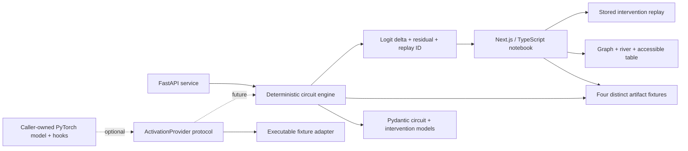

# Circuit Interpretability

> An intervention-first notebook for testing circuit hypotheses.

[](https://marinjursic.github.io/CircuitInterpretability/)
[](https://github.com/MarinJursic/CircuitInterpretability/actions/workflows/pages.yml)

[](https://nextjs.org/)
[](https://www.typescriptlang.org/)
[](https://fastapi.tiangolo.com/)
[](https://www.python.org/)
[](#verification)
[](#verification)

Circuit Interpretability turns a cached artifact into a testable circuit hypothesis. Its numbered
notebook moves in one direction—**Trace → Intervene → Validate**—so the graph is never
mistaken for the conclusion:

- move between four materially different fixture studies from a compact index;
- read the same circuit as a topology graph, a layer-ordered river, or an accessible table;
- select an attention head, MLP, sparse feature, error node, or output logit;
- **suppress**, **amplify**, or **patch** its activation;
- compare baseline and result logits;
- inspect the attributed delta, stored intervention delta, and unexplained residual;
- disclose the exact artifact manifest only when it is needed.

No credentials, model weights, or GPU are required. The four included examples are
locally authored deterministic fixtures with different graph topologies:

| Artifact | Structure exercised | Reference target |
| --- | --- | --- |
| Jordan → basketball | ambiguous name, athlete branch, country competitor | Gemma 2 2B schema |
| Peso → baht | relational analogy and target-currency competition | Gemma 2 2B schema |
| Expansion → NASA | multi-token acronym formation | Gemma 2 2B schema |
| 36 + 59 → 95 | digit binding, carry, composition, formatting | Gemma 2 2B schema |

The model name is a compatibility target, not provenance for the numbers. No
checkpoint was downloaded or executed. Every surface shows
`DETERMINISTIC FIXTURE` / `NO MODEL RUNNING`, and every result returns
`evidence_class: deterministic-fixture`.

## Continuous app walkthrough

[](docs/walkthrough/app-walkthrough.mp4)

[Watch the full-resolution H.264 walkthrough](docs/walkthrough/app-walkthrough.mp4) · [Open the poster frame](docs/walkthrough/app-walkthrough-poster.jpg)

The walkthrough uses only the running application. It opens the Jordan →
basketball study, reads the Graph and River representations, selects the
Basketball association MLP, runs its stored suppress branch, follows the page
into validation, and switches theme.
No interface screen is mocked or generated. Path width encodes larger authored
fixture contribution; line style, labels, and color distinguish positive,
negative, residual, and branch-changed paths.

## Why this exists

Attribution graphs and activation patching are most useful when they lead to falsifiable interventions. A visually important node is not automatically causal; Circuit Interpretability therefore centers the workflow on a before/after execution rather than treating a graph as an explanation by itself.

The MVP deliberately separates three claims:

1. **Attribution hypothesis** — the displayed paths summarize estimated influence in one cached run.
2. **Causal test** — an intervention changes one component and observes downstream behavior.
3. **Interpretation** — a human-readable label is a tentative description, not a uniquely correct semantic meaning.

Circuit Interpretability does **not** claim to reveal private chain-of-thought, a definitive reasoning transcript, or the one true circuit used by a model.

## Product walkthrough

1. Choose one of four artifacts from the numbered study index.
2. The **Circuit Graph** displays tokens, attention paths, MLP/SAE/error features,
   residual flow, and the output logit. Only paths touching the selected component
   receive labels, which prevents the graph from turning into a wall of annotations.
3. Switch to **Layer River** for a depth-ordered view, or **Table** for the same
   important values in an accessible text representation.
4. Select a component. The evidence column shows its fixture depth, activation
   magnitude, attribution score, stored token examples, and artifact identifier.
5. Choose:
   - **Suppress** — scale the selected activation to zero.
   - **Amplify** — scale it to `1.80×`.
   - **Patch** — replace it with a contrast-run activation.
6. Run the branch. The result reports the baseline and result logit, observed
   fixture delta, changed nodes, and first stored downstream change.
7. Continue to **Validate** for the attribution-versus-intervention contract.
   Expand provenance only when the schema, evidence class, hashes, source, or caveat
   is needed. The interface never labels a fixture percentage as confidence.

The default fixture is intentionally easy to read:

```text
Original:  Michael Jordan → athlete → basketball association → “basketball”
Branch:    Basketball association suppressed
Stored first change: Layer 12
Baseline / result logit: 4.21 / 1.75
Attributed / observed fixture Δ: −2.18 / −2.46
Unexplained residual: −0.28
```

The numbers above are authored deterministic test data. `L0–L18` is a normalized
fixture-depth axis, not a claim that every item is a transformer block. Values
validate the product and API workflow; they are not measurements from Gemma or any
other downloaded checkpoint.

## Architecture



### Frontend

| Surface | Responsibility |
| --- | --- |
| `app/branchtrace-app.tsx` | Numbered study index, graph/river/table trace, evidence, intervention, validation, and provenance disclosure |
| `app/circuit-data.ts` | Four distinct typed artifacts, exact manifests, and stored logit/intervention measurements |
| `app/globals.css` | Responsive editorial-notebook system with light/dark graph styling |
| `app/layout.tsx` | Product metadata and social preview |

Both visualizations are purpose-built and dependency-light: contribution paths are
rendered in SVG, while nodes remain semantic HTML buttons with visible keyboard
focus and `aria-pressed` state. The Layer River prevents same-layer nodes from
overlapping by assigning them explicit vertical lanes; the Circuit Graph preserves
the authored topology and applies only collision-safe horizontal nudges. A tested,
horizontally scrollable minimum canvas keeps labels intact
on narrow screens instead of shrinking them into illegibility. The UI provides
tested light and dark themes, initializes from the saved preference or system
preference without a theme flash, honors reduced-motion preferences, and reflows for
tablet/mobile layouts. At 1280 pixels, the evidence column moves below the full-width
trace so the complete graph remains visible. Phone layouts replace the wide detail
canvas with a complete compact labeled overview; Table remains the interactive
text-equivalent. Automated contrast checks enforce WCAG AA for every light-theme
small-text token and the primary hover state.

### Python service

| Module | Responsibility |
| --- | --- |
| `service/branchtrace/models.py` | Typed nodes, edges, runs, intervention requests, and divergence results |
| `service/branchtrace/fixtures.py` | Reproducible study fixtures |
| `service/branchtrace/engine.py` | Pure circuit synthesis, intervention semantics, and replay hashing |
| `service/branchtrace/adapters.py` | Runtime-checkable provider protocol, shape-checked executable fixture adapter, and explicit PyTorch hook seam |
| `service/branchtrace/main.py` | FastAPI transport, OpenAPI docs, CORS, and domain-error mapping |

The engine is pure and deterministic. Identical intervention inputs produce an
identical 16-character replay ID. Every graph includes an error/residual node and an
`ArtifactManifest`; every intervention result includes baseline/result logits,
observed and attributed deltas, residual, evidence class, and caveat. Model-specific
code stays behind `ActivationProvider`.

## Quick start

### Requirements

- Node.js `22.13+`
- Python `3.11+`

### 1. Install the web app

```bash
npm ci
npm run dev
```

Open the local URL printed by the development server (normally [http://localhost:3000](http://localhost:3000)).

### 2. Start the API

In a second terminal:

```bash
python3 -m venv .venv
source .venv/bin/activate
pip install -e "service[dev]"
uvicorn branchtrace.main:app --app-dir service --reload
```

The service is available at:

- API: [http://127.0.0.1:8000](http://127.0.0.1:8000)
- Swagger UI: [http://127.0.0.1:8000/docs](http://127.0.0.1:8000/docs)
- OpenAPI schema: [http://127.0.0.1:8000/openapi.json](http://127.0.0.1:8000/openapi.json)

The browser demo remains fully interactive when the API is not running because its fixtures are bundled. The service exists as the production-grade typed boundary for circuit generation and intervention execution.

## API

### `GET /health`

Returns the engine and fixture version.

### `GET /v1/demos`

Lists the built-in studies.

### `GET /v1/circuits/{demo_id}`

Returns the baseline model run plus typed circuit nodes and edges.

### `POST /v1/interventions`

```bash
curl -X POST http://127.0.0.1:8000/v1/interventions \
  -H "Content-Type: application/json" \
  -d '{
    "demo_id": "factual-recall",
    "feature_id": "mlp-basketball",
    "mode": "suppress"
  }'
```

The result contains:

- original and branched `ModelRun` values;
- `first_layer`, `changed_node_ids`, and `answer_changed`;
- selected contribution before and after the intervention;
- baseline and result logits;
- stored observed delta, attributed delta, and unexplained residual;
- explicit `evidence_class: deterministic-fixture`;
- a stable `deterministic_replay_id`;
- an explicit fixture caveat.

Supported modes are `suppress`, `amplify`, and `patch`. Optional `strength` is an activation scale constrained to `[0, 4]`; `patch_source` is accepted only for patch requests, must be non-empty, and becomes part of the deterministic replay identity. Unknown demos/features return `404`; malformed modes, out-of-range strength, and invalid mode-specific fields return `422`.

## Verification

Run all web checks:

```bash
npm run verify
```

`npm run verify` builds the production worker, type-checks and lints the web app,
runs 17 Vitest component/interaction checks and 8 Node circuit/rendering checks,
checks the Python service with Ruff, runs 25 engine/API tests, and audits npm
dependencies. The individual Python test command is:

```bash
.venv/bin/pytest service/tests
```

Verified locally:

| Check | Result |
| --- | --- |
| Vinext/Next.js production build | Passed |
| Vitest component, interaction, geometry, and validation tests | 17 passed |
| Node circuit-engine, contrast, and server-rendered product tests | 8 passed |
| ESLint | Passed |
| TypeScript compiler (`--noEmit`) | Passed |
| Python formatting and linting (Ruff) | Passed |
| Deterministic engine, adapter, and FastAPI contracts | 25 passed |
| End-to-end API flow (`demos → circuit → suppress`) | Passed |
| Live HTTP smoke (`/`, `/health`, `/v1/interventions`) | Passed |
| npm production/development dependency audit | 0 vulnerabilities |

The 50 tests comprise 17 Vitest checks, 8 Node test-runner checks, and 25 Python
checks. Together they cover theme persistence, typed graph synthesis, materially
distinct topologies, stored suppression/patch/amplification, negative controls,
logit deltas, residual accounting, provenance, replay stability, artifact-specific
labels, adapter target/shape validation, invalid IDs and request fields, API health,
and a complete answer-changing workflow.

## From fixture to real model

A production adapter would:

1. accept a caller-owned open-weight `torch.nn.Module`;
2. register narrowly scoped forward hooks for residual, attention, and MLP locations;
3. persist only the activation summaries needed for the selected method;
4. learn or load an SAE/transcoder dictionary where appropriate;
5. calculate an attribution score using a declared metric;
6. replay a true activation ablation or patch;
7. return results through the existing `CircuitGraph` and `InterventionResult` models.

Model loading is intentionally out of scope for this credential-free MVP. The browser’s “snapshots” and model-version deltas are deterministic fixtures, not loaded checkpoints or empirical evaluation results. This avoids hidden downloads, license ambiguity, large disk usage, and misleading claims that fixture outputs came from Gemma or any other named checkpoint. Wiring a real model also requires declaring tokenizer alignment, hook locations, patch metric, corruption baseline, batching policy, device/dtype behavior, and activation retention limits.

## Interpretability caveats

- **Graphs are lossy.** A sparse graph omits interactions and may not be complete.
- **Feature labels are hypotheses.** SAE features can split, merge, or remain polysemantic.
- **Attribution is not intervention.** A high attribution score should predict a causal effect, but this must be measured.
- **Patching depends on the metric and corruption setup.** Results can be misleading when the baseline, patch source, or target metric is poorly chosen.
- **One prompt is not a behavior.** Stability should be measured across paraphrases, contexts, seeds, and model checkpoints.
- **Replacement models add approximation error.** A transcoder or SAE-derived graph does not exactly reproduce the original network.

The next research-grade evaluation would report faithfulness, completeness, sparsity, paraphrase stability, causal precision, and human comprehension—not graph aesthetics alone.

## Research grounding

Circuit Interpretability’s design is informed by primary sources:

- Google’s [Material 3 Expressive research](https://design.google/library/expressive-material-design-google-research) motivates using hierarchy to pull attention toward the next meaningful action, without importing the visual style of a generic dashboard.
- W3C’s [WCAG 2.2](https://www.w3.org/TR/WCAG22/) and [ARIA Authoring Practices](https://www.w3.org/WAI/ARIA/apg/) inform visible focus, target sizing, disclosure, radio-group, and pressed-state behavior.
- The UK Government’s [data visualisation guidance](https://brand.design-system.service.gov.uk/data/) motivates the text-equivalent table and the use of line style and labels in addition to color.
- Anthropic’s [Circuit Tracing: Revealing Computational Graphs in Language Models](https://transformer-circuits.pub/2025/attribution-graphs/methods.html) introduces attribution graphs built with cross-layer transcoders and emphasizes validation tooling.
- Anthropic’s [Tracing Attention Computation Through Feature Interactions](https://transformer-circuits.pub/2025/attention-qk/index.html) extends attribution graphs to attention feature interactions.
- Bricken et al., [Towards Monosemanticity](https://transformer-circuits.pub/2023/monosemantic-features/index.html), demonstrates sparse-autoencoder feature decomposition and basic circuit analysis.
- Templeton et al., [Scaling Monosemanticity](https://transformer-circuits.pub/2024/scaling-monosemanticity/index.html), studies SAE features at production-model scale while documenting important limitations.
- Heimersheim and Nanda, [How to use and interpret activation patching](https://arxiv.org/abs/2404.15255), explains what evidence patching provides and why metric choice and corruption design can change the conclusion.
- Zhang and Nanda, [Towards Best Practices of Activation Patching in Language Models](https://arxiv.org/abs/2309.16042), systematically finds that metric and corruption-method choices can produce disparate localization results.
- Kramár et al., [AtP*: An efficient and scalable method for localizing LLM behaviour to components](https://arxiv.org/abs/2403.00745), evaluates scalable attribution-patching approximations and documents false-negative failure modes.

These references motivate the intervention-first workflow; they do not validate the included fixture values.

## Project status

This repository is a complete local MVP:

- polished responsive web interface;
- four immediately explorable studies;
- three intervention modes;
- original-versus-branched execution comparison;
- visible first divergence and changed answer;
- model-version circuit diff;
- typed deterministic API;
- executable, validated model-adapter contract plus an explicit unimplemented PyTorch seam;
- automated frontend, engine, API, and smoke verification;
- no credentials or model download required.

## License

No license has been selected for this portfolio project. Add one before redistributing or accepting external contributions.
